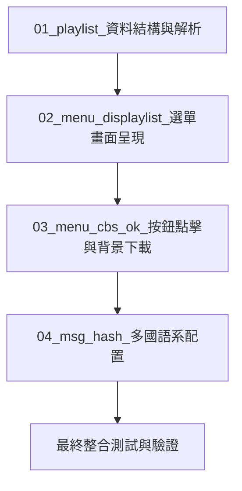

# 00_master_checklist_總體進度檢核表

本文件用於追蹤「遊戲清單（.lpl）下載功能」的所有開發進度。各個階段的詳細實作指南已分別存檔於同目錄下的子任務文件中。

---

## 📌 開發與部署順序

請按照以下順序進行開發，以確保程式碼的依賴關係正確（資料結構優先於 UI 及邏輯）：



---

## 📝 總體進度檢核表 (Master Checklist)

- [ ] **階段 1：播放清單資料處理** (詳細指引：[01_playlist_資料結構與解析.md](file:///d:/test/retroarch/plan/task/01_playlist_%E8%B3%87%E6%96%99%E7%B5%90%E6%A7%8B%E8%88%87%E8%A7%A3%E6%9E%90.md))
  - [ ] 1.1 擴充 `struct playlist_entry` 結構體（新增 `download` 指標）
  - [ ] 1.2 修改 `playlist_free_entry` 以安全釋放記憶體
  - [ ] 1.3 於 `JSONObjectMemberHandler` 支援 JSON 解析 `"download"` 欄位
  - [ ] 1.4 於 `playlist_write_file` 支援將 `"download"` 寫回檔案

- [ ] **階段 2：選單 UI 呈現** (詳細指引：[02_menu_displaylist_選單畫面呈現.md](file:///d:/test/retroarch/plan/task/02_menu_displaylist_%E9%81%B8%E5%96%AE%E7%95%AB%E9%9D%A2%E5%91%88%E7%8F%BE.md))
  - [ ] 2.1 定義下載項目的 UI 顯示類型
  - [ ] 2.2 於 `menu_displaylist_parse_horizontal_content_actions` 中加入顯示判斷
  - [ ] 2.3 檢查 `download` 欄位存在且本地路徑檔案不存在
  - [ ] 2.4 將「下載遊戲」項目動態附加（Append）至操作選單中

- [ ] **階段 3：動作點擊與異步背景下載** (詳細指引：[03_menu_cbs_ok_按鈕點擊與背景下載.md](file:///d:/test/retroarch/plan/task/03_menu_cbs_ok_%E6%8C%89%E9%88%90%E9%BB%9E%E6%93%8A%E8%88%87%E8%83%8C%E6%99%AF%E4%B8%8B%E8%BC%89.md))
  - [ ] 3.1 於 `menu_cbs_ok.c` 宣告 `g_playlist_download_in_progress` 單一下載鎖
  - [ ] 3.2 實作 `action_ok_playlist_entry_download()` 點擊觸發函數
  - [ ] 3.3 於觸發時檢查下載鎖，並於忙碌時發送提示訊息
  - [ ] 3.4 實作遞迴目錄建立邏輯（使用 `fill_pathname_parent_dir` 與 `path_mkdir`）
  - [ ] 3.5 初始化 `file_transfer_t` 並呼叫 `task_push_http_transfer_file()`
  - [ ] 3.6 實作任務結束回呼函數，在完成（成功/失敗）時解除鎖定

- [ ] **階段 4：多國語系定義** (詳細指引：[04_msg_hash_多國語系配置.md](file:///d:/test/retroarch/plan/task/04_msg_hash_%E5%A4%9A%E5%9C%8B%E8%AA%9E%E7%B3%BB%E9%85%8D%E7%BD%AE.md))
  - [ ] 4.1 在 `msg_hash.h` 定義選單語系常數
  - [ ] 4.2 修改 `intl/msg_hash_us.h`（英文預設值 `"Download Game"`）
  - [ ] 4.3 修改 `intl/msg_hash_zh_tw.h`（繁體中文值 `"下載遊戲"`）
  - [ ] 4.4 修改 `intl/msg_hash_zh_cn.h`（簡體中文值 `"下载游戏"`）

- [ ] **階段 5：最終整合測試與驗證**
  - [ ] 5.1 確認帶有 `download` 的 `.lpl` 可被正確解析且不影響舊格式
  - [ ] 5.2 驗證當檔案已存在時，選單中是否正確隱藏「下載遊戲」選項
  - [ ] 5.3 驗證當父資料夾不存在時，點選下載是否能自動建立資料夾並儲存
  - [ ] 5.4 驗證多工攔截提示是否能正常運作（單一下載限制）

---

## ⚠️ 踩坑記錄與編譯問題檢討 (Troubleshooting & Lessons Learned)

### 1. 連結錯誤：`undefined reference to 'menu_cbs_exit'`
* **發生原因**：
  在 `03_menu_cbs_ok_按鈕點擊與背景下載` 階段實作 `action_ok_playlist_entry_download` 時，複製了測試範例 `plan/skill/examples/playlist_download_example.c` 內用於模擬 Mock 的 `menu_cbs_exit()` 呼叫。但該函數在真實的 RetroArch 程式碼中並不存在，且在實作時並未提供相應定義，導致連結時失敗：
  ```text
  undefined reference to `menu_cbs_exit`
  ```
* **正確做法 / 修正方式**：
  RetroArch 的選單點擊事件回呼函數（`action_ok_...`）在遇到無效檢查或阻擋時，應遵循標準規範直接返回 `-1`，而成功觸發並發起任務時則返回 `0`。
  直接移除 `menu_cbs_exit()` 呼叫並替換為整數：
  - 阻擋/出錯處：`return -1;`
  - 成功執行處：`return 0;`
